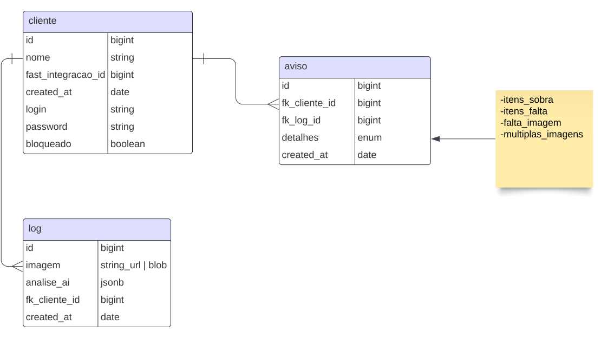

# Levantamento Requisitos

## Requisitos

### Machine Learning

- Treinamento da AI para reconhecer as fotos do armário e identificar os itens que estão faltando
  - É necessário uma base de fotos de armário para realizar o treinamento de máquina.
  - É importante ressaltar que caso seja adicionado um novo tipo de peça (armazenada no armário) na equação é necessário fazer um re-treinamento da AI.

### Ponto de Entrada de Dados

- RESTful API para fornecer ponto de entrada para as imagens do armário que os clientes enviarão.
  - Spring Boot.

### Cadastro de Clientes

- Essa API precisa possibilitar cadastro basico de clientes para que seja possivel fornecer uma forma de autenticação para os pontos de entrada de dados;
  - O cadastro de clientes sera realizado de forma manual pela Fast, contando com uma interface Web ou Mobile para realizar a ação;
  - Caso a Fast já tenha um cadastro de clientes em sua base de dados, é preferível que seja feita uma integração para que seja possível mapear os cadastros.

### Inteligência Artifical

- Ao receber a imagem, nosso serviço irá consultar a Inteligência Artifical para obter dados sobre os produtos identificados no armário.
  - O sistema deve salvar um log no banco de dados com a imagem capturada pela inteligencia artificial (podendo ser em blob ou link apontando para um bucket de terceiros) e os itens que a inteligencia artificial apontou (podendo ser em json ou já em uma estrutura de tabelas).

### Base de Dados de OS da Fast

- Após o processo de análise da imagem, nosso serviço ainda é responsável por comunicar com a base de dados da Fast para identificar se os dados batem com o registro de Ordem de Serviço.
  - Para isso, é necessário que a Fast forneça um Endpoint para nossa aplicação realizar a consulta;
  - Dependendo de como foi feito o cadastro dos clientes, é necessário pensar em uma forma de integrar o ID do cliente da nossa aplicação com o cadastro de cliente da Fast.
- Caso haja uma disparidade de registro de peças deve ser gerado um aviso no banco de dados relacionado com a log e o cliente.

### Gerenciamento Fast

- O gerenciamento dos avisos deve ser feito pela Fast. A responsabilidade da nossa aplicação é apenas registrar os ocorrêncios para fins de log e notificar a Fast por E-mail ou alguma outra forma.
  - É possivel criar uma interface futuramente caso haja a necessidade.
- O gerenciamento das fotos segue o mesmo princípio, fica sob responsabilidade da Fast exigir que os clientes façam os envios das fotos mensalmente.
  - Apesar disso, é possivel criar uma rotina no nosso serviço para verificar todos os clientes que não enviaram uma foto no mês e enviar um E-mail de aviso para a fast.

## Diagrama de Classe

### Aviso

Serve para armazenar os diferentes avisos que um cliente pode receber. Os tipos de avisos incluem:

- Produtos faltando
  - Caso haja uma discrepância entre os itens identificados pela AI e o registro de Ordem de Serviço da Fast
- Produtos a mais
  - Caso haja uma discrepância entre os itens identificados pela AI e o registro de Ordem de Serviço da Fast. Apesar de ser itens a mais, é importante armazenar um aviso para entender um possível erro da AI ou erro nas ordens de serviço.
- Não enviou foto do armário
  - Caso o cliente não tenha enviado a foto do armário no mês.
- Enviou mais de uma foto do armário
  - Caso o cliente enviou mais de uma foto do armário.

### Logs

Serve para armazenar o envio de foto do cliente. Guarda informações como resultado da análise da AI, a foto enviada pelo cliente, o cliente que enviou a foto e o dia e horário de envio.

### Cliente

Serve para armazenar o cadastro dos clientes da aplicação. Tem uma coluna reservada para o ID de integração para caso seja necessário integrar com uma base de clientes já existente da Fast. Possui também um username e password para acessar a funcionalidade de envio de foto.
